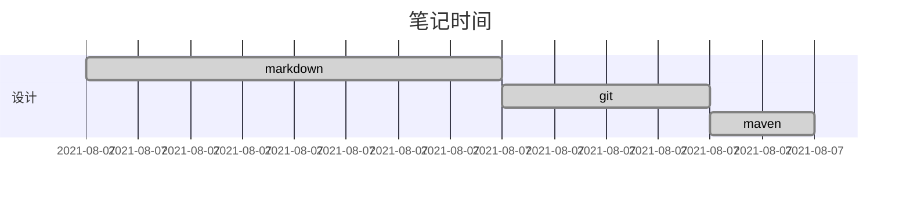

# note

## 笔记目录 *不分顺序*  
|名称|启动时间|完成时间|
|:----:|:----:|:----:|
|git|2021年8月7日|2021年8月7日|
|markdowm|2021年8月7日|2021年8月7日|
|maven|2021年8月7日|2021年8月7日|

## 历程

```mermaid
gantt
    dateFormat  YYYY-MM-DD HH:mm:ss
    title 笔记时间
    section 设计
    markdown                 :done,des1, 2021-8-7,4h
    git                      :done,des2, after des1, 2h
    maven                    :done,des3, after des2, 1h
        
```
